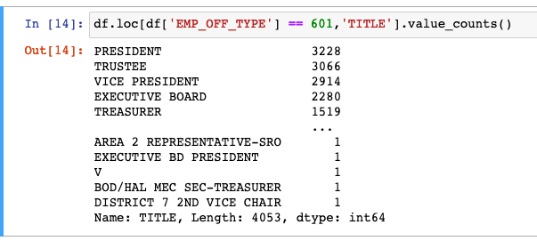

# Union Elections
A data gathering, cleaning, and analysis project to discover the rate of churn among USA labor union leadership. 

Our main datasource is going to be the US Department of Labor and their wonderful [website.](https://olmsapps.dol.gov/olpdr/) 

The "Yearly Data Download pulls zip archives filled with pipe delimited text documents. These will be the best way to pull the data. I will worry about automating this process for updates down the line. For now I am going to just pull the data manually.

Looks like the electronic records only go back to 2000. Could be better, but it should be enough to see whether recent events have made any noticeable impact on union electoral behavior. 

I have fairly fast internet, but nothing crazy, 200mbs up and down. The downloads were done in under 5 minutes, and that's with me needing to click 44 times. Now I gotta unzip them all. 

And just like that (this new M1 really is a beast) I have a gig of text in my repo. Not what you want, but it's a start.

Based on this sample [form](https://olmsapps.dol.gov/query/orgReport.do?rptId=739980&rptForm=LM2Form) and this less than ideal [documentation](https://olmsapps.dol.gov/olpdr/Guide_to_Working_with_OLMS_LM_Data.pdf) I have identified the "ar_disbursements_emp_off_data_YYYY.txt" file as the officers disclosure, which is what we're interested in. Let's take a look at 2020, the most recent full year of data.

I really shouldn't be surprised, but there are random double quotes all over the first file I tried to look at. I'll need to write something to get rid of those eventually, but for now I'll just clear the things out of the 2020 file with find/replace.

TODO: write a ksh or zsh script to pull all the files you actually want out of the archives. That way we can keep from getting too cluttered.

~~TODO: write a ksh, zsh, or python script to clear out quotes (") from all files.~~

That worked, here are the columns we're working with:

OID is probably a unique identifier per record, but I should check some other files to see if it pings off of any other file.

EMP_OFF_TYPE is interesting, I wonder if that can narrow things down to leadership somehow. Let's see.

So there are three broad categories. Would be dope if one of them were leadership!

Those look like officers to me! The top titles for 602 were Organizer, Secretary, and Business Representative, so they're probably non-elected employees. 603 didn't have any titles filled in. We'll focus on records coded 601 from here out.

Now we have leaders for a given year, but we have to associate them with their organizations before we can say with confidence that there was some kind of leadership change year over year. There's nothing in this file that can accomplish that -- unsurprising as these are disbursement records, not census. 

However, thanks to our trusty [less than ideal documentation](https://olmsapps.dol.gov/olpdr/Guide_to_Working_with_OLMS_LM_Data.pdf) we know that each of these reports have a report id which tie all the pieces back into a single filing. We have the RPT_ID right there in the next to last column. So we need another file to pull down the org ID.

The documentation points us toward "lm_data_data_YYYY.txt, so there I go. 

There are a bunch of columns on this file, but I'll spare you most of them. We get RPT_ID, which is the most important thing. There's also a union name, which is good, but they seem like pretty shoddy names. For instance: "COMMUNICATIONS WORKERS AFL-CIO" appears no less than 605 times. Some of them have distinct UNIT_NAMEs but far from all of them. Their addresses should be distinct, but it's a real pain in the ass to invent a key based on distinct string data. I would LOVE IT if this F_NUM turned out to be a unique organization identifier. Let's take a look.

Well, that's about as unique as it gets. Truth be told, I would feel better if I could see one org sending multiple forms under the same F_NUM. Tell you what -- let's look across years. 

That's a single number pointing to a single organization across years. I think we can take that to be the DOL's internal file number or something approaching it. 

OK, so we have the officers, the orgs, and a link between them, let's merge.

I'll spare you the gory details. The code is in the EDA notebook if you really want to see it. Point is our final table per year looks like this:

We a bunch of null values in Unit Name, as we expected. We're also missing some First and Last names, which is interesting, but we're not missing any middle names. Weird. 

Without names these records are just going to be useless anyway, so I'm going to drop them.

Much better! That's EDA about done. Time to do some data engineering and do all these steps for all the other years in the set. Then we'll engineer some kind of "changed" variable and report on the relative rates of leadership change across time. Is gonna be fun!

